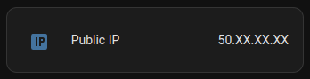
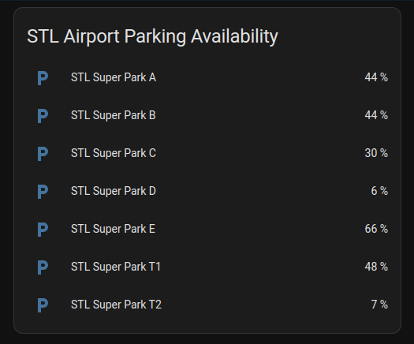
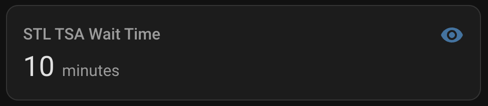

# ha-integrations
Custom Home Assistant integrations

## public_ip

The Public IP integration displays the Home Assistant's public IP address. The integration sends a GET request to `https://checkip.amazonaws.com` every 15 minutes to check if the IP has changed.



- Copy the `public_ip` directory to the configuration folder `config/custom_components/`
- Add the integration to the yaml configuration file

```
sensor:
  - platform: public_ip
```

## stl_superpark

The STL Super Park integration displays the parking availability at the St. Louis Airport. The integration sends a GET request to `https://superparkinglot.com` every 15 minutes and parses the parking availability for each lot.



- Copy the `stl_superpark` directory to the configuration folder `config/custom_components/`
- Add the integration to the yaml configuration file

```
sensor:
  - platform: stl_superpark
```

## tsa_wait_time

The TSA Wait Time integration displays the current TSA security line wait time for the specified airport in the configuration file. The integration sends a GET request to `https://www.tsa.gov/api/checkpoint_waittime/v1/{{AIRPORT CODE}}` every 15 minutes and parses the wait time.



- Copy the sensor details from the `tsa_wait_time/configuration.yaml` file and add to your Home Assistant configuration `config/configuration.yaml`
- Change the airport code to match the airport you would like to monitor

## Helpful Links

- https://developers.home-assistant.io/docs/core/entity/sensor
- https://dev.to/adafycheng/write-custom-component-for-home-assistant-4fce
